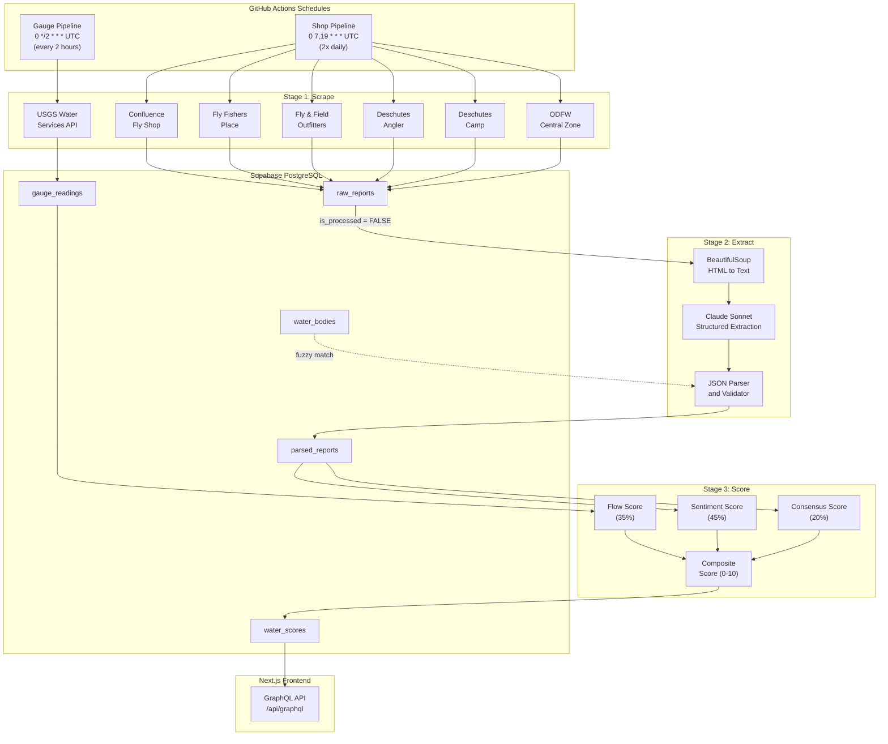
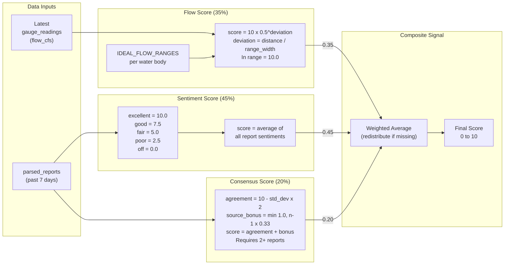
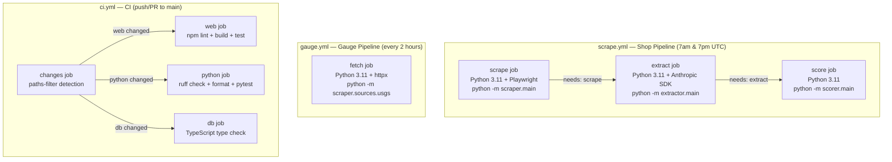

# Score.Fish Pipeline Architecture

This document describes the offline data pipeline that powers Score.Fish's fishing condition signals. The pipeline scrapes fly shop reports, extracts structured data via LLM, and computes composite scores — all orchestrated by GitHub Actions on a cron schedule.

## High-Level Pipeline Flow



## Data Flow Sequence

```mermaid
sequenceDiagram
    participant GH as GitHub Actions
    participant SC as Scraper
    participant PW as Playwright Browser
    participant WEB as Fly Shop Sites
    participant USGS as USGS API
    participant DB as Supabase Postgres
    participant EX as Extractor
    participant CL as Claude Sonnet
    participant SR as Scorer
    participant API as GraphQL API

    rect rgb(12, 74, 110)
    Note over GH,DB: Stage 1 — Scrape (cron: 7am & 7pm UTC)
    GH->>SC: trigger scraper.main
    SC->>PW: launch headless Chromium
    loop For each of 6 sources
        SC->>PW: navigate to shop index
        PW->>WEB: HTTP GET index page
        WEB-->>PW: HTML response
        PW-->>SC: discover_posts() — URLs
        loop For each post URL
            SC->>PW: navigate to post
            PW->>WEB: HTTP GET post page
            WEB-->>PW: HTML response
            PW-->>SC: extract_content() — text
            SC->>SC: SHA256 content hash
            SC->>DB: INSERT raw_reports (ON CONFLICT DO NOTHING)
        end
    end
    SC->>PW: close browser
    end

    rect rgb(12, 74, 110)
    Note over GH,DB: USGS Gauge Fetch (cron: every 2 hours)
    GH->>SC: trigger scraper.sources.usgs
    SC->>USGS: GET /nwis/iv/ (flow, temp, height)
    USGS-->>SC: JSON response
    SC->>DB: INSERT gauge_readings (ON CONFLICT DO NOTHING)
    end

    rect rgb(55, 48, 163)
    Note over GH,CL: Stage 2 — Extract (runs after scrape)
    GH->>EX: trigger extractor.main
    EX->>DB: SELECT raw_reports WHERE is_processed = FALSE
    DB-->>EX: unprocessed reports
    loop For each raw report
        EX->>EX: BeautifulSoup — plain text
        EX->>CL: extraction prompt + report text
        CL-->>EX: structured JSON response
        EX->>EX: parse and validate JSON
        EX->>DB: resolve water_body_name to water_body_id
        EX->>DB: INSERT parsed_reports
        EX->>DB: UPDATE raw_reports SET is_processed = TRUE
    end
    end

    rect rgb(6, 95, 70)
    Note over GH,DB: Stage 3 — Score (runs after extract)
    GH->>SR: trigger scorer.main
    SR->>DB: SELECT water_bodies
    DB-->>SR: all water bodies
    loop For each water body
        SR->>DB: SELECT latest gauge_readings
        SR->>DB: SELECT parsed_reports (past 7 days)
        SR->>SR: score_flow (vs ideal range)
        SR->>SR: score_sentiment (avg)
        SR->>SR: score_consensus (std dev)
        SR->>SR: compute_composite (weighted)
        SR->>DB: UPSERT water_scores
    end
    end

    rect rgb(131, 24, 67)
    Note over API,DB: Frontend Serves Scores
    API->>DB: query water_scores, parsed_reports, gauge_readings
    DB-->>API: current signals and data
    end
```



## Database Schema

```mermaid
erDiagram
    water_bodies {
        uuid id PK
        text name
        text slug UK
        text type
    }

    raw_reports {
        uuid id PK
        text source_name
        text source_url
        text raw_html
        text content_hash
        timestamp fetched_at
        boolean is_processed
    }

    gauge_readings {
        uuid id PK
        text station_id
        uuid water_body_id FK
        timestamp measured_at
        float flow_cfs
        float gauge_height_ft
        float water_temp_f
        timestamp fetched_at
    }

    parsed_reports {
        uuid id PK
        uuid raw_report_id FK
        uuid water_body_id FK
        text source_name
        date report_date
        text sentiment
        jsonb species_mentioned
        jsonb fly_patterns_mentioned
        text conditions_summary
        text flow_commentary
        text water_clarity
        jsonb hatches
        text river_section
        jsonb raw_extraction
        timestamp extracted_at
    }

    water_scores {
        uuid id PK
        uuid water_body_id FK
        date score_date
        float composite_score
        float flow_score
        float sentiment_score
        float consensus_score
        jsonb recommended_species
        jsonb recommended_flies
        text summary
        jsonb components
        timestamp scored_at
    }

    water_bodies ||--o{ gauge_readings : "has readings"
    water_bodies ||--o{ parsed_reports : "has reports"
    water_bodies ||--o{ water_scores : "has scores"
    raw_reports ||--o{ parsed_reports : "extracted into"
```



## Scoring Algorithm



---

## Stage Details

### Stage 1: Scraper (`jobs/scraper/`)

The scraper fetches raw fishing reports from 6 Central Oregon fly shops and government sources using a headless Chromium browser via Playwright.

**Architecture**: All scrapers extend `BaseScraper` (`sources/base.py`), which provides a common lifecycle:

1. Navigate to the shop's index page
2. `discover_posts(page)` — find individual report URLs (abstract, each source implements its own selectors)
3. `extract_content(page)` — pull plain text from each report page (abstract)
4. SHA256 hash the content for deduplication
5. Insert into `raw_reports` with `ON CONFLICT (source_name, content_hash) DO NOTHING`

| Source | Site | Scraping Strategy |
|--------|------|-------------------|
| `confluence.py` | confluenceflyshop.com | WordPress/Elementor CTA blocks |
| `fly_fishers.py` | flyfishersplace.com | WordPress listing-item links |
| `fly_and_field.py` | flyandfield.com | Shopify blog article links |
| `deschutes_angler.py` | deschutesangler.com | Shopify blog report links |
| `deschutes_camp.py` | deschutescamp.com | WordPress entry-title links |
| `odfw.py` | myodfw.com | Single-page government report |

**USGS Gauge Fetcher** (`sources/usgs.py`) runs independently on a 2-hour schedule. It uses `httpx` (not Playwright) to fetch JSON from the USGS Water Services API for 6 stations:

| Station ID | Water Body |
|-----------|------------|
| 14092500 | Lower Deschutes |
| 14050000 | Upper Deschutes |
| 14076500 | Middle Deschutes |
| 14087400 | Crooked River |
| 14057500 | Fall River |
| 14091500 | Metolius |

Parameters fetched: flow (cfs), gauge height (ft), water temperature (C, converted to F).

### Stage 2: Extractor (`jobs/extractor/`)

The extractor processes unprocessed `raw_reports` through Claude Sonnet to produce structured fishing condition data.

**Pipeline per report**:

1. **HTML to text** — BeautifulSoup parses `raw_html` using source-specific CSS selectors (`CONTENT_SELECTORS` map), then strips tags. Truncated to 20,000 chars.
2. **LLM extraction** — Claude Sonnet receives a system prompt defining the expected JSON schema and a list of known water bodies. The user prompt contains the report text.
3. **Parse and validate** — `parser.py` strips markdown fences, parses JSON, validates sentiment values against `{excellent, good, fair, poor, off}`, and validates hatch structure.
4. **Water body resolution** — 3-tier fuzzy matching:
   - Exact match against `water_bodies.name` or `slug`
   - Substring match (e.g., "deschutes" partial matching)
   - Source default fallback (e.g., `deschutes_angler` defaults to Lower Deschutes)
5. **Persist** — Insert into `parsed_reports`, then flip `raw_reports.is_processed = TRUE`.

**Extracted fields per water body mention**: sentiment, species, fly patterns, conditions summary, flow commentary, water clarity, hatches (name/stage/timing), river section, report date.

### Stage 3: Scorer (`jobs/scorer/`)

The scorer computes a composite fishing signal (0-10) for each water body by combining three sub-scores.

**Flow Score** (`flow_score.py`, weight: 35%):
- Compares the latest `gauge_readings.flow_cfs` against `IDEAL_FLOW_RANGES` from config
- Within ideal range: score = 10.0
- Outside range: exponential decay `10 * 0.5^(distance / range_width)`

**Sentiment Score** (`sentiment_score.py`, weight: 45%):
- Maps each report's sentiment to a numeric value (excellent=10, good=7.5, fair=5, poor=2.5, off=0)
- Returns the average across all reports from the past 7 days

**Consensus Score** (`consensus_score.py`, weight: 20%):
- Measures agreement across multiple sources (requires 2+ reports)
- `agreement = 10 - (std_deviation * 2)`
- Adds a source diversity bonus: `min(1.0, (num_sources - 1) * 0.33)`

**Composite** (`composite.py`):
- Weighted average of available sub-scores
- If a sub-score is missing (e.g., no gauge data), its weight is redistributed proportionally among the remaining scores
- Result is upserted into `water_scores` for today's date

---

## GitHub Actions Orchestration



All workflows support `workflow_dispatch` for manual triggering. The shop pipeline jobs run sequentially via `needs:` dependencies — if scraping fails, extraction and scoring are skipped.

---

## Error Handling and Resilience

| Stage | Strategy | Detail |
|-------|----------|--------|
| Scraper | Source-level isolation | If one shop scraper fails, others continue. Per-report `SAVEPOINT` prevents one bad insert from rolling back the batch. |
| Scraper | Content deduplication | SHA256 hash + `ON CONFLICT DO NOTHING` means re-scraping the same content is a no-op. |
| Extractor | Per-report processing | Failed extraction logs the error and moves on. The report stays `is_processed = FALSE` for retry on the next run. |
| Extractor | Fuzzy matching | 3-tier water body resolution handles name variations from the LLM. |
| Scorer | Per-water-body `SAVEPOINT` | Failure scoring one water body doesn't block others. |
| Scorer | Missing data tolerance | If a sub-score is unavailable (no gauge data, no reports), weights redistribute rather than failing. |

---

## External Dependencies

| Service | Purpose | Auth |
|---------|---------|------|
| 6 fly shop websites | Scrape fishing reports | None (public) |
| USGS Water Services API | Gauge readings (flow, temp, height) | None (public) |
| Anthropic Claude API | LLM structured extraction | `ANTHROPIC_API_KEY` |
| Supabase PostgreSQL | All data persistence | `DATABASE_URL` |

---

## Local Development

```bash
cd jobs
pip install -r requirements.txt
playwright install chromium

# Run each stage independently
python -m scraper.main           # Stage 1: scrape shop reports
python -m scraper.sources.usgs   # Fetch USGS gauge data
python -m extractor.main         # Stage 2: LLM extraction
python -m scorer.main            # Stage 3: compute signals

# Verify pipeline state
psql $DATABASE_URL -c "SELECT COUNT(*) FROM raw_reports WHERE is_processed = FALSE;"
psql $DATABASE_URL -c "SELECT water_body_id, composite_score, scored_at FROM water_scores ORDER BY scored_at DESC LIMIT 10;"
```

Requires `.env` at repo root with `DATABASE_URL` and `ANTHROPIC_API_KEY`.
